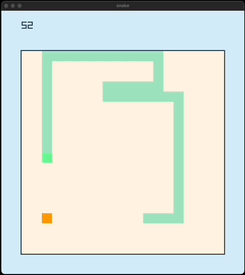

## Snake Algorithm 🐍

This project is a Snake game implemented using the Raylib library, where the snake uses Breadth-First Search (BFS) to find food and Flood Fill for survival in challenging situations. The AI ensures the snake avoids walls and its own body.

### Features

- Pathfinding: The snake uses BFS to determine the shortest path to the food.
- Survival Mode: If no path to the food exists, a flood fill algorithm identifies the safest possible move to maximize survival.
- Self-Avoidance: The snake ensures it does not collide with its own body.
- Wall Avoidance: The snake avoids colliding with walls.
- Graphics: Built using the Raylib library for visual representation.

### Running visualization

> go run .

